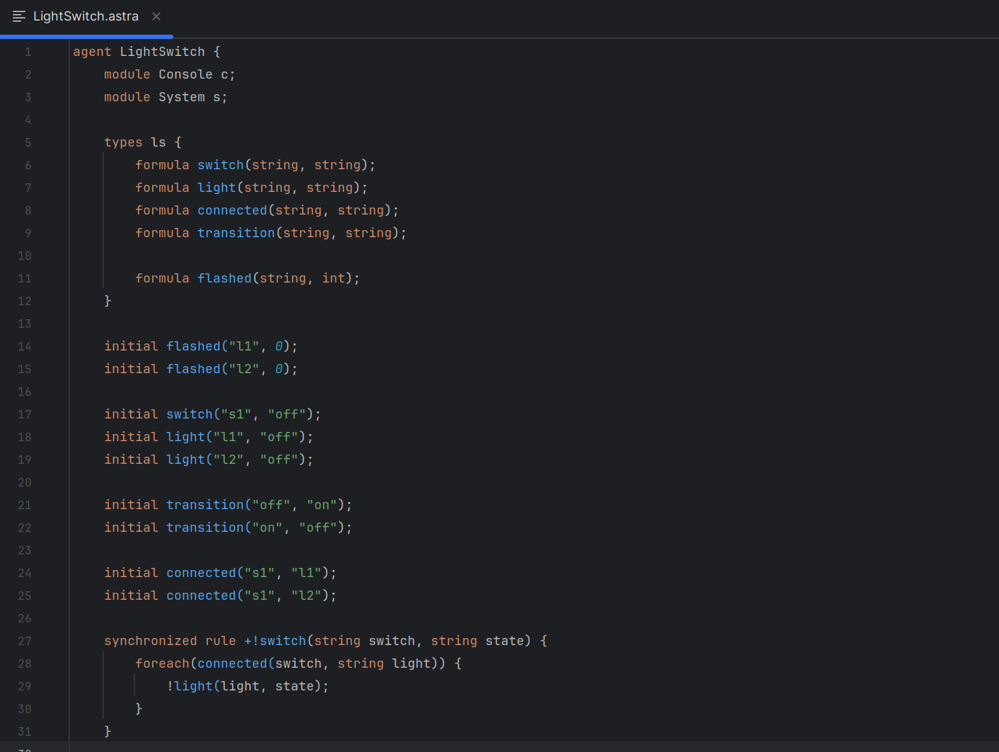

# ASTRA Syntax Highlighting for IntelliJ and TextMate

Syntax highlighting for ASTRA in editors that support TextMate bundles, such 
as IntelliJ and TextMate.

This is a (semi)automated build generated from the original 
[ASTRA VSCode plugin](https://gitlab.com/astra-language/vscode-language-astra).

## Installation Instructions

### IntelliJ IDEA

1. **Download the Bundle**

   - Download the `astra.tmbundle.zip` from the
     [Releases](https://github.com/mxschll/textmate-grammar-astra/releases)
     page.
   - Extract the `astra.tmbundle` folder from the zip file.

2. **Install the Bundle in IntelliJ IDEA**

   - Open IntelliJ IDEA.
   - Go to `File` > `Settings` (or `IntelliJ IDEA` > `Preferences` on macOS).
   - Navigate to `Editor` > `TextMate Bundles`.
   - Click the **`+`** button to add a new bundle.
   - Select the extracted `astra.tmbundle` directory.
   - Click `Apply` and `OK` to save the changes.

### TextMate

1. **Download the Bundle**

   - Download the `astra.tmbundle.zip` from the
     [Releases](https://github.com/mxschll/textmate-grammar-astra/releases) page.
   - Ensure the file is unzipped.

2. **Install the Bundle in TextMate**

   - Double-click the `astra.tmbundle` folder.
   - TextMate should automatically recognize and install the bundle.
   - Alternatively, you can copy the `astra.tmbundle` directory to
     `~/Library/Application Support/TextMate/Bundles/`.

3. **Reload Bundles**

   - In TextMate, go to `Bundles` > `Bundle Editor` > `Reload Bundles` to
           refresh the bundle list.
